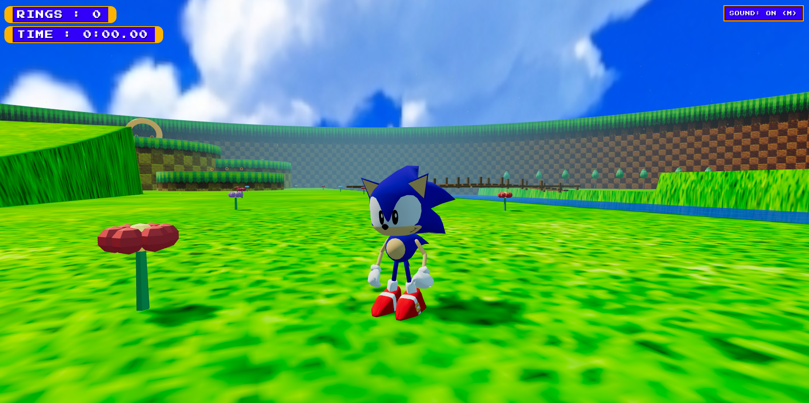

# Sonic Hub World

A 3D Sonic the Hedgehog hub world built with Three.js - inspired by the overworld from _Sonic Jam_ for the Sega Saturn.

You can play the game [here](https://duartebranco.github.io/sonic-hub-world/).



## Gameplay

Free-roam exploration across a procedurally-terrained island with plateaus, ramps, lakes, and a wooden bridge. Collect rings scattered across the world, defeat MotoBug enemies with spin dashes or homing attacks, and find the giant ring to start the time-trial challenge - collect 50 rings as fast as you can.

| Feature | |
|---|---|
| Movement | WASD / arrow keys, camera-relative |
| Jump | Space (variable height on release) |
| Spin dash | Hold Shift or X, release to launch |
| Homing attack | Jump near an enemy, press jump again |
| Camera | Mouse drag / pointer lock, scroll to zoom, auto-align after 1s idle |
| Audio | M to toggle mute |
| Challenge | Enter the giant ring to start the race |

## Tools

- `src/animator.html` - Editor for the custom keyframe animation format
- `src/benchmark.html` - Benchmarking tool for performance testing
- `src/map_editor.html` - In-browser editor for placing world objects

## Build 

If you want, you can serve from the project root with any static HTTP server:

```bash
npx serve .
# or if you want to specify a port
python -m http.server 3000
```

Then open `http://localhost:3000` (or the port that you chose).

## Credits

- Sonic [model](https://sketchfab.com/3d-models/sonic-jam-cgi-1c05780f967a475aa92d60cbf937b284)
- SFX sourced from [Open Surge](https://github.com/DroidSparks/opensurge) and [Open Sonic JS](https://github.com/clarkeadg/opensonic-js) - see `audio/sfx/CREDITS.md` for details and licensing

Built for [Introduction to Computer Graphics](https://www.ua.pt/en/uc/7930), University of Aveiro, 2025/2026.
