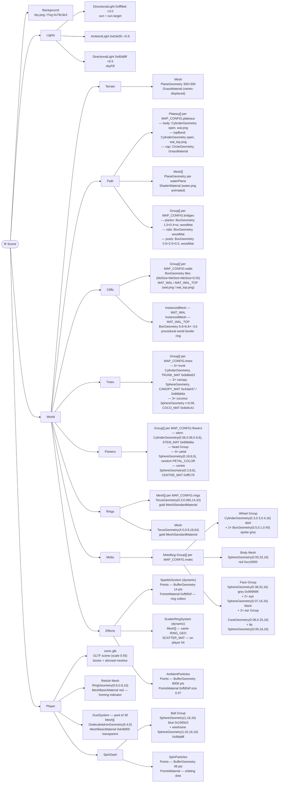

# Scene Graph

```mermaid
graph LR
    Scene(["🌐 Scene"])

    Scene --> BG["Background\nsky.png / Fog 0x79c3e3"]
    Scene --> Lights
    Scene --> World
    Scene --> Player

    Lights --> Sun["DirectionalLight 0xfff9e6 ×3.0\nsun + sun.target"]
    Lights --> Ambient["AmbientLight 0xb3e5fc ×0.9"]
    Lights --> SkyFill["DirectionalLight 0x80d8ff ×0.5\nskyFill"]

    World --> Terrain
    World --> Path
    World --> Cliffs
    World --> Trees
    World --> Flowers
    World --> Rings
    World --> Mobs
    World --> Effects

    Terrain --> TerrainMesh["Mesh\nPlaneGeometry 300×300\nGrassMaterial (vertex-displaced)"]

    Path --> Plateaus["Plateau[] per MAP_CONFIG.plateaus\n— body: CylinderGeometry open, wal.png\n— topBand: CylinderGeometry open, wal_top.png\n— cap: CircleGeometry, GrassMaterial"]
    Path --> WaterPlanes["Mesh[]\nPlaneGeometry per waterPlane\nShaderMaterial (water.png animated)"]
    Path --> Bridges["Group[] per MAP_CONFIG.bridges\n— planks: BoxGeometry 1.5×0.4×w, woodMat\n— rails: BoxGeometry, woodMat\n— posts: BoxGeometry 0.5×2.5×0.5, woodMat"]

    Cliffs --> CliffWalls["Group[] per MAP_CONFIG.walls\nBoxGeometry tiles (tileSize×tileSize×tileSize×0.55)\nMAT_WAL / MAT_WAL_TOP (wal.png / wal_top.png)"]
    Cliffs --> BorderWalls["InstancedMesh — MAT_WAL\nInstancedMesh — MAT_WAL_TOP\nBoxGeometry 6.6×6.6×~3.6\nprocedural world border ring"]

    Trees --> PalmTree["Group[] per MAP_CONFIG.trees\n— 6× trunk CylinderGeometry, TRUNK_MAT 0x8d6e63\n— 3× canopy SphereGeometry, CANOPY_MAT 0x43a047 / 0x66bb6a\n— 3× coconut SphereGeometry r=0.09, COCO_MAT 0x6d4c41"]

    Flowers --> FlowerGroup["Group[] per MAP_CONFIG.flowers\n— stem: CylinderGeometry(0.06,0.08,0.9,6), STEM_MAT 0x66bb6a\n— head Group\n  — 6× petal SphereGeometry(0.18,6,5), random PETAL_COLOR\n  — centre SphereGeometry(0.2,8,6), CENTRE_MAT 0xfff176"]

    Rings --> RingMeshes["Mesh[] per MAP_CONFIG.rings\nTorusGeometry(0.3,0.065,14,32)\ngold MeshStandardMaterial"]
    Rings --> GoalRing["Mesh\nTorusGeometry(4.0,0.8,16,64)\ngold MeshStandardMaterial"]

    Mobs --> MotoBug["MotoBug Group[] per MAP_CONFIG.mobs"]
    MotoBug --> Wheel["Wheel Group\nCylinderGeometry(0.3,0.3,0.4,16) dark\n+ 2× BoxGeometry(0.5,0.1,0.45) spoke grey"]
    MotoBug --> Body["Body Mesh\nSphereGeometry(0.55,32,16)\nred 0xcc0000"]
    MotoBug --> Face["Face Group\nSphereGeometry(0.38,32,16) grey 0x999999\n+ 2× eye SphereGeometry(0.07,16,16) black\n+ 2× ear Group\n    ConeGeometry(0.06,0.25,16)\n    + tip SphereGeometry(0.06,16,16)"]

    Effects --> Sparkles["SparkleSystem (dynamic)\nPoints — BufferGeometry 14 pts\nPointsMaterial 0xffd54f — ring collect"]
    Effects --> ScatterRings["ScatterRingSystem (dynamic)\nMesh[] — same RING_GEO\nSCATTER_MAT — on player hit"]
    Effects --> AmbientPts["AmbientParticles\nPoints — BufferGeometry 8000 pts\nPointsMaterial 0xffd54f size 0.07"]

    Player --> Model["sonic.glb\nGLTF scene (scale 0.55)\nbones + skinned meshes"]
    Player --> Reticle["Reticle Mesh\nRingGeometry(0.6,0.8,16)\nMeshBasicMaterial red — homing indicator"]
    Player --> Dust["DustSystem — pool of 30\nMesh[] DodecahedronGeometry(0.4,0)\nMeshBasicMaterial 0xb4bf00 transparent"]
    Player --> SpinDash["SpinDash"]
    SpinDash --> Ball["Ball Group\nSphereGeometry(1,16,16) blue 0x1565c0\n+ wireframe SphereGeometry(1.02,16,16) 0x99ddff"]
    SpinDash --> SpinParticles["SpinParticles\nPoints — BufferGeometry 48 pts\nPointsMaterial — orbiting dots"]
```
