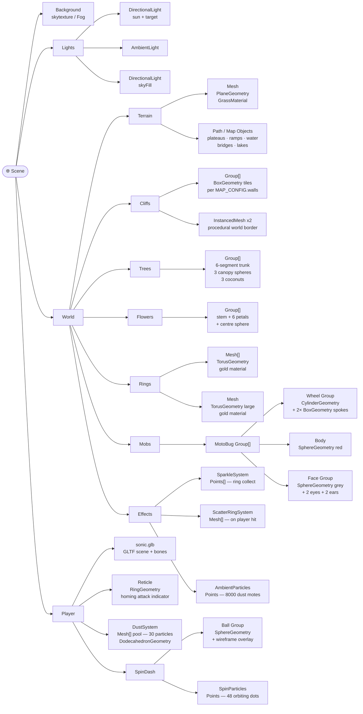

# Scene Graph

```mermaid
graph LR
    Scene(["🌐 Scene"])

    Scene --> BG["Background\nskytexture / Fog"]
    Scene --> Lights
    Scene --> World
    Scene --> Player

    Lights --> Sun["DirectionalLight\nsun + target"]
    Lights --> Ambient["AmbientLight"]
    Lights --> SkyFill["DirectionalLight\nskyFill"]

    World --> Terrain
    World --> Cliffs
    World --> Trees
    World --> Flowers
    World --> Rings
    World --> Mobs
    World --> Effects

    Terrain --> TerrainMesh["Mesh\nPlaneGeometry\nGrassMaterial"]
    Terrain --> Path["Path / Map Objects\nplateaus · ramps · water\nbridges · lakes"]

    Cliffs --> CliffWalls["Group[]\nBoxGeometry tiles\nper MAP_CONFIG.walls"]
    Cliffs --> BorderWalls["InstancedMesh x2\nprocedural world border"]

    Trees --> PalmTree["Group[]\n6-segment trunk\n3 canopy spheres\n3 coconuts"]

    Flowers --> FlowerGroup["Group[]\nstem + 6 petals\n+ centre sphere"]

    Rings --> RingMeshes["Mesh[]\nTorusGeometry\ngold material"]
    Rings --> GoalRing["Mesh\nTorusGeometry large\ngold material"]

    Mobs --> MotoBug["MotoBug Group[]"]
    MotoBug --> Wheel["Wheel Group\nCylinderGeometry\n+ 2× BoxGeometry spokes"]
    MotoBug --> Body["Body\nSphereGeometry red"]
    MotoBug --> Face["Face Group\nSphereGeometry grey\n+ 2 eyes + 2 ears"]

    Effects --> Sparkles["SparkleSystem\nPoints[] — ring collect"]
    Effects --> ScatterRings["ScatterRingSystem\nMesh[] — on player hit"]
    Effects --> AmbientPts["AmbientParticles\nPoints — 8000 dust motes"]

    Player --> Model["sonic.glb\nGLTF scene + bones"]
    Player --> Reticle["Reticle\nRingGeometry\nhoming attack indicator"]
    Player --> Dust["DustSystem\nMesh[] pool — 30 particles\nDodecahedronGeometry"]
    Player --> SpinDash["SpinDash"]
    SpinDash --> Ball["Ball Group\nSphereGeometry\n+ wireframe overlay"]
    SpinDash --> SpinParticles["SpinParticles\nPoints — 48 orbiting dots"]
```
